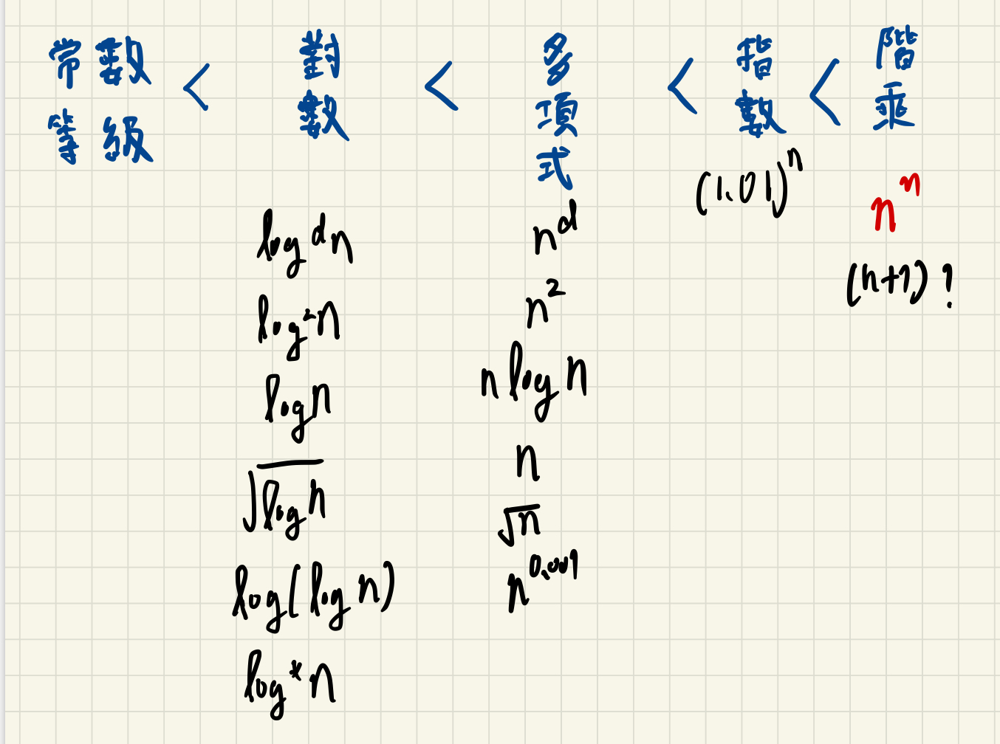

## 常用的數學公式

* 等差數列公式：  
 $$ x = {(\text{首項} + \text{尾項})\times \text{項數} \over 2}.$$

* 等比數列公式：
 $$ x = {\text{最後一項} \times (1 - r ^ n)} \over 1-r$$

* $$\sum_{i=1}^{\infty} 1^2 + 2^2 +3^2 +....+n^2 $$=
 $$ n\times (n+1) \times(2n+1)\over 6 $$

* $$\sum_{i=1}^{\infty} i^d $$ 約莫是 <mark>$$n^{d+1} $$</mark>
* 調和數列 $${\sum_{n=1}^{\infty} {1\over i}} = {1 \over 1} + {1 \over 2}+ {1 \over 3}+....+ {1 \over n} =\log n$$
* 階乘系列

    * $$n!=1\times 2\times 3 ...n $$  $$\leq {n\times n \times .... \times n , \forall n \geq 1 }$$
    * $$n! \geq (n/2)^{(n/2)}$$

## Growth rate

## Big-oh:O
$$ {f(n) =O(g(n))} \Leftrightarrow$$  exists two positive constant  c and n0  